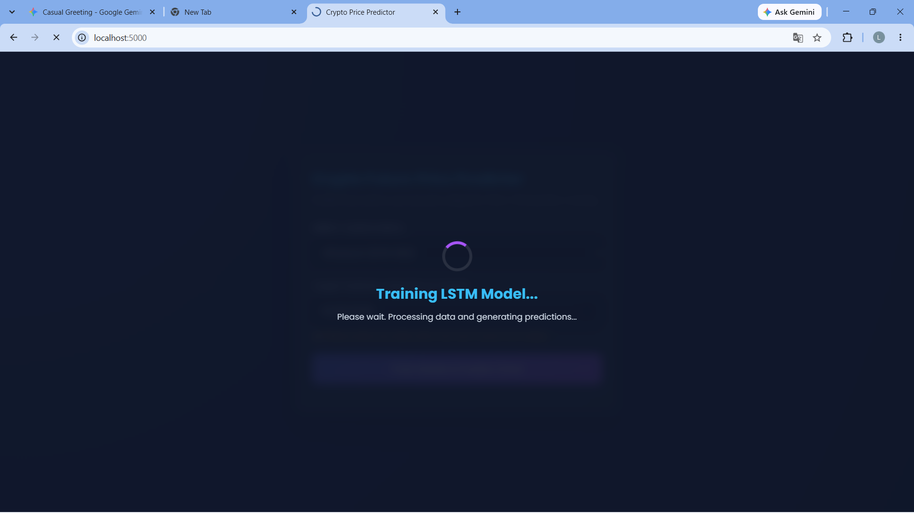
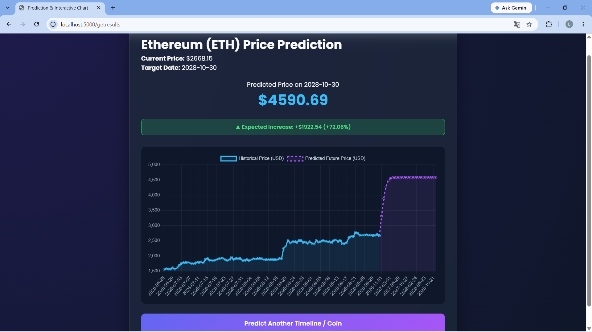

# 🚀 ETH SOL Price Predictor (Flask & Deep LSTM)

An intelligent web application designed to forecast cryptocurrency price trends up to **4 years (1,460 days)** into the future. Powered by Python Flask, Yahoo Finance API, and a custom deep **LSTM (Long Short-Term Memory)** neural network optimized for long-term time-series predictions aligned with crypto market cycles.

---

## 📸 Application Screenshots

### 1. Home / Input Interface
Select cryptocurrency and target prediction date up to 4 years.


### 2. Model Training Overlay
Real-time feedback animation while fetching data and training the LSTM model.


### 3. Price Prediction & Interactive Chart
Comprehensive forecast dashboard showing expected price movement, percentage change, and future chart trends.


---

## 📌 Key Features

- **Multi-Year Market Predictions:** Forecasts crypto prices up to 4 years ahead (1,460 days) to match market cycle patterns.
- **Deep LSTM Architecture:** Uses a 4-layer funnel neural network (128-96-64-32 units) fine-tuned to process 90-day time step dependencies without overfitting.
- **Real-Time Data Integration:** Automatically fetches live market data using `yfinance` with fallback data range settings (`period='2y'` or `period='max'`).
- **Validated Interactive UI:** Responsive HTML5/CSS3 frontend featuring date range restrictions (today up to 4 years), native HTML attributes, and smooth CSS loading animations during backend training.

---

## 🛠️ Tech Stack

- **Backend Framework:** Python Flask
- **Machine Learning & Data Processing:** TensorFlow / Keras, NumPy, Pandas, Scikit-learn
- **Data Source:** Yahoo Finance API (`yfinance`)
- **Frontend:** HTML5, CSS3, JavaScript (ES6), Jinja2 Templates

---

## 🧠 Model Architecture & Hyperparameters

The neural network utilizes a **Funnel-Structured Deep LSTM Architecture** to balance model capacity and training efficiency:

- **Look-back Window (`time_steps`):** 90 Days
- **Training Epochs:** 20 Epochs
- **Batch Size:** 32
- **Optimizer & Loss:** Adam Optimizer, Mean Squared Error (`mse`)
- **Layer Pipeline:**
  1. `LSTM (128 units, return_sequences=True)` + `Dropout(0.2)`
  2. `LSTM (96 units, return_sequences=True)` + `Dropout(0.2)`
  3. `LSTM (64 units, return_sequences=True)` + `Dropout(0.2)`
  4. `LSTM (32 units, return_sequences=False)` + `Dropout(0.2)`
  5. `Dense (1 unit, activation='linear')`

---
# 🚀 Getting Started

## 1. Prerequisites

Make sure the following software is installed:

- **Python 3.8 or higher**
- **Git**
- **VS Code** (recommended)
- Internet connection for retrieving cryptocurrency data from Yahoo Finance

You can check your Python version with:

```bash
python --version
```

---

## 2. Clone the Repository

Clone the project from GitHub:

```bash
git clone https://github.com/your-username/crypto-price-predictor.git
```

Move into the project directory:

```bash
cd crypto-price-predictor
```

> Replace `https://github.com/your-username/crypto-price-predictor.git` with the actual repository URL if you have already created the GitHub repository.

---

## 3. Create & Activate Virtual Environment

Using a virtual environment is recommended because it keeps the project's Python packages isolated from other Python projects.

### Windows

Create the virtual environment:

```bash
python -m venv env
```

Activate it in **Command Prompt**:

```cmd
env\Scripts\activate
```

Activate it in **PowerShell**:

```powershell
.\env\Scripts\Activate.ps1
```

After activation, your terminal should show something similar to:

```text
(env) C:\...\crypto-price-predictor>
```

### macOS / Linux

Create the virtual environment:

```bash
python3 -m venv env
```

Activate it:

```bash
source env/bin/activate
```

---

## 4. Install Dependencies

With the virtual environment activated, install the required Python packages:

```bash
pip install flask tensorflow yfinance pandas numpy scikit-learn
```

You can also install the dependencies from the project's `requirements.txt` file:

```bash
pip install -r requirements.txt
```

### Main Dependencies

```text
Flask
TensorFlow
Keras
yfinance
Pandas
NumPy
Scikit-learn
```

---

## 5. Run the Application

Make sure the virtual environment is activated and run:

```bash
python main.py
```

If the application starts successfully, Flask will display a local address similar to:

```text
Running on http://127.0.0.1:5000/
```

Open your web browser and navigate to:

```text
http://127.0.0.1:5000/
```

---

# 📁 Project Structure

The project follows this structure:

```text
crypto-price-predictor/
│
├── templates/
│   └── eth_details.html
│       # Frontend UI, forms, CSS styles,
│       # and JavaScript logic
│
├── main.py
│   # Flask application, yfinance data fetching,
│   # preprocessing, LSTM model training,
│   # and future price prediction
│
├── README.md
│   # Complete project documentation
│
└── requirements.txt
    # Required Python packages
```

---

